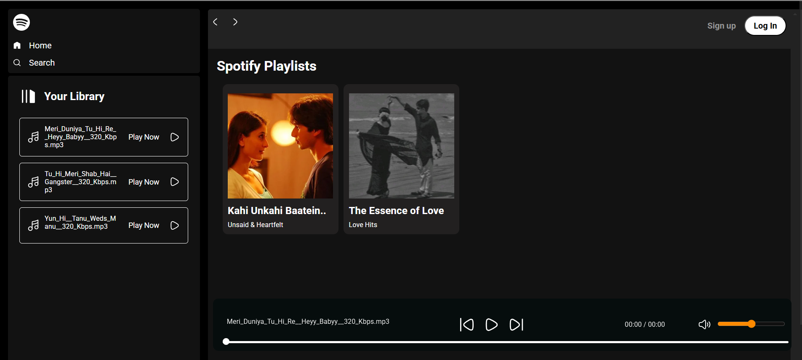

# Spotify-Clone

Welcome to the **Spotify Clone** project! 🎶

This project is a web-based music streaming application inspired by the famous Spotify platform. Built using **HTML**, **CSS**, and **JavaScript**, this clone showcases the core functionality of Spotify’s interface, allowing users to browse and play music from a beautifully designed user interface.

### **Features**:
- **Responsive Design**: Looks great on mobile and desktop.
- **Music Player**: Play, pause, and skip music.
- **Custom Playlist**: Navigate through playlists.
- **Intuitive Navigation**: Easy access to the music library.

### **Technologies Used**:
- **HTML5**
- **CSS3**
- **JavaScript**

### **Installation**:
1. Clone the repository:
    ```bash
    git clone https://github.com/vivekk-31/Spotify-Clone.git
    ```
2. Open the project in your browser.

### **Screenshots**:

